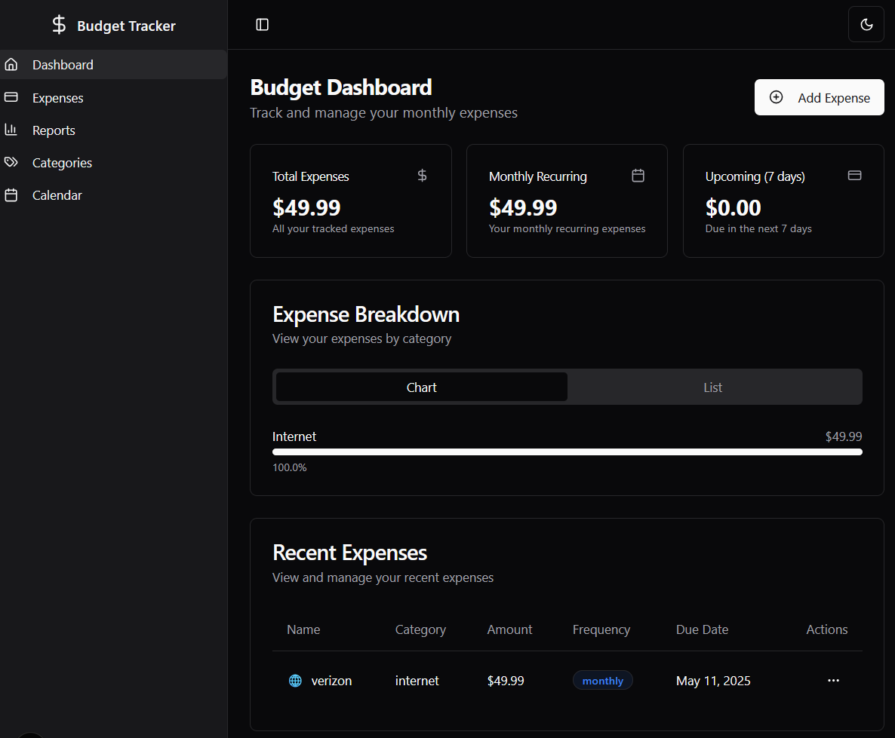

# 💰 bdgtr - Self-Hosted Budget Tracker

A modern, privacy-focused budget tracking application built with Next.js and shadcn/ui. Track your living expenses with a beautiful dark-themed dashboard, all while keeping your data local and secure.


*Dark-themed dashboard for tracking house-related expenses*

## 🌟 Key Features

### 📊 Dashboard Overview
- Total expenses summary
- Monthly recurring expenses tracker
- Upcoming expenses (next 7 days)
- Visual expense breakdown by category
- Dark theme by default for comfortable viewing

### 💳 Expense Tracking
- Add and manage expenses with:
  - 📝 Name and amount
  - 🏷️ Category with emoji (e.g., "🏠 Housing", "🔌 Utilities")
  - 🔄 Frequency options (one-time, daily, weekly, monthly, etc.)
  - 📅 Due date tracking

### 🔒 Privacy-First
- **100% Local Storage**: All data stays in your browser
- **No Server Required**: Works completely offline
- **Self-Contained**: No external dependencies for data storage
- **Private**: Your financial data never leaves your device

### 📱 Responsive Design
- Works seamlessly on desktop and mobile
- Adaptive sidebar for different screen sizes
- Clean, modern interface

## 🛠️ Technology Stack

- **Framework**: Next.js with App Router
- **UI Components**: shadcn/ui
- **Styling**: Tailwind CSS
- **State Management**: React Hooks
- **Data Storage**: Browser Local Storage
- **Type Safety**: TypeScript

## 🚀 Getting Started

1. Clone the repository:
```bash
git clone https://github.com/supthunder/bdgtr.git
cd bdgtr
```

2. Install dependencies:
```bash
pnpm install
```

3. Run the development server:
```bash
pnpm dev
```

4. Open [http://localhost:3000](http://localhost:3000) in your browser

## 📱 Usage

1. **Adding Expenses**
   - Click "Add Expense" button
   - Fill in expense details (name, amount, category)
   - Select frequency and due date
   - Submit to save

2. **Viewing Analytics**
   - See total expenses on the dashboard
   - View categorized spending
   - Track upcoming payments
   - Monitor recurring expenses

3. **Managing Expenses**
   - Edit existing expenses
   - Delete unwanted entries
   - Filter by categories
   - Sort by date or amount

## 🔐 Data Privacy

All data is stored locally in your browser's localStorage. This means:
- No data is ever sent to any servers
- Your financial information remains completely private
- Data persists between sessions
- You can clear data any time using browser settings

## 🤝 Contributing

Contributions are welcome! Feel free to:
- Report bugs
- Suggest features
- Submit pull requests

## 📄 License

MIT License - feel free to use this project for personal or commercial purposes. 